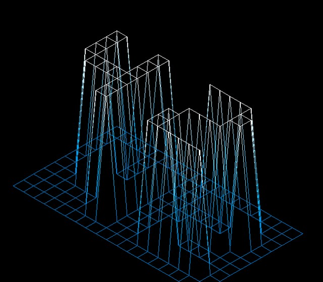

# FDF
3D Wire frame visualization using the Minilibix library from 42 Silicon Valley

### Input
```
$> cat -e 42.fdf
0  0  0  0  0  0  0  0  0  0  0  0  0  0  0  0  0  0  0$
0  0  0  0  0  0  0  0  0  0  0  0  0  0  0  0  0  0  0$
0  0 10 10  0  0 10 10  0  0  0 10 10 10 10 10  0  0  0$
0  0 10 10  0  0 10 10  0  0  0  0  0  0  0 10 10  0  0$
0  0 10 10  0  0 10 10  0  0  0  0  0  0  0 10 10  0  0$
0  0 10 10 10 10 10 10  0  0  0  0 10 10 10 10  0  0  0$
0  0  0 10 10 10 10 10  0  0  0 10 10  0  0  0  0  0  0$
0  0  0  0  0  0 10 10  0  0  0 10 10  0  0  0  0  0  0$
0  0  0  0  0  0 10 10  0  0  0 10 10 10 10 10 10  0  0$
0  0  0  0  0  0  0  0  0  0  0  0  0  0  0  0  0  0  0$
0  0  0  0  0  0  0  0  0  0  0  0  0  0  0  0  0  0  0$
$>
```

### Output

